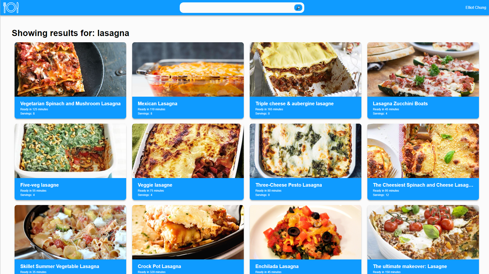
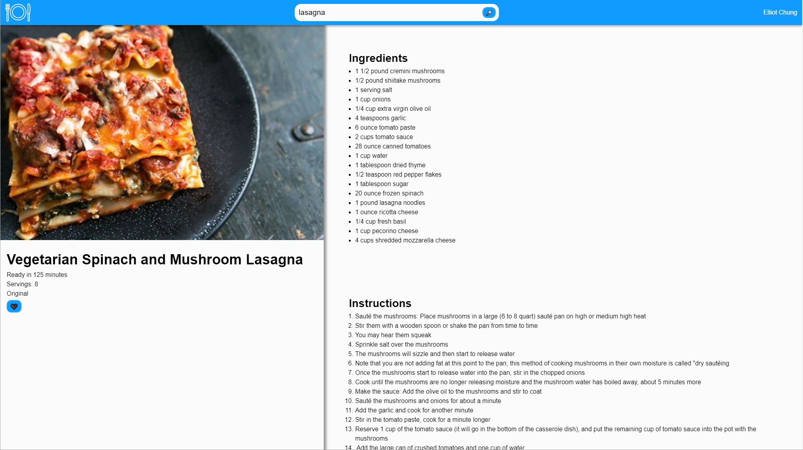
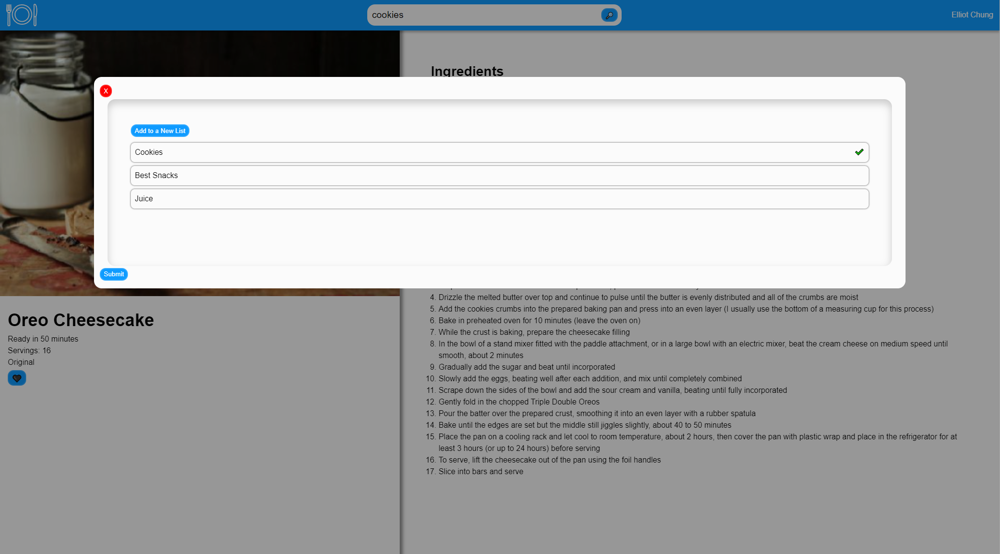

# Fullstack MERN Recipes Application

## You can Find the Website ([Here](https://react-recipe-app-kappa.vercel.app/))

## Overview

This is a small application for finding and tracking recipes. User can search through a large catalog of recipes and save their favorites to lists; which are saved to each users' own account. The app is implemented using the MERN stack. There are further details on the tools/libraries used in FRONTEND.md and BACKEND.md.

## Search and Find Thousands of Recipes

## Create Lists of Your Favorite Recipes

